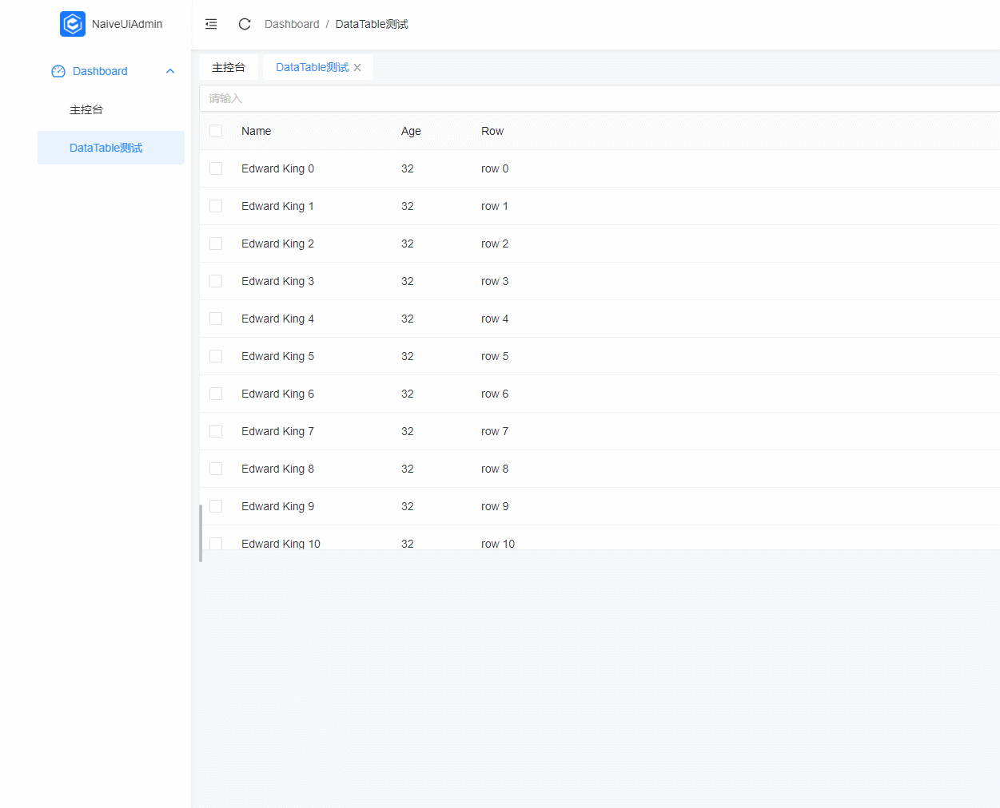

账号：admin，密码：123456（随意）

## 使用

- 获取项目代码

```bash
git clone https://github.com/MYxu/naive-ui-admin-demo.git
```

- 运行

```bash
yarn dev
```


- /src/views/dashboard/monitor/monitor.vue
```
<template>
  <div>
    <n-input v-model="inputVal" />
    <n-data-table
      ref="table"
      :columns="columns"
      :data="data"
      :max-height="500"
      :scroll-x="1800"
      virtual-scroll
    />
  </div>
</template>

<script>
  import { ref, h, defineComponent } from 'vue';
  const columns = [
    {
      type: 'selection',
      fixed: 'left',
    },
    {
      title: 'Name',
      key: 'name',
      width: 200,
      fixed: 'left',
    },
    {
      title: 'Age',
      key: 'age',
      width: 100,
      fixed: 'left',
    },
    {
      title: 'Row',
      key: 'row',
      render(row, index) {
        return h('span', ['row ', index]);
      },
    },
    {
      title: 'Row1',
      key: 'row1',
      render(row, index) {
        return h('span', ['row ', index]);
      },
    },
    {
      title: 'Row2',
      key: 'row2',
      render(row, index) {
        return h('span', ['row ', index]);
      },
      width: 100,
      fixed: 'right',
    },
    {
      title: 'Address',
      key: 'address',
      width: 200,
      fixed: 'right',
    },
  ];
  export default defineComponent({
    name: 'dashboard_monitor',
    setup() {
      return {
        inputVal: ref(0),
        data: Array.apply(null, { length: 5000 }).map((_, index) => ({
          key: index,
          name: `Edward King ${index}`,
          age: 32,
          address: `London, Park Lane no. ${index}`,
        })),
        columns,
      };
    },
  });
</script>
```
