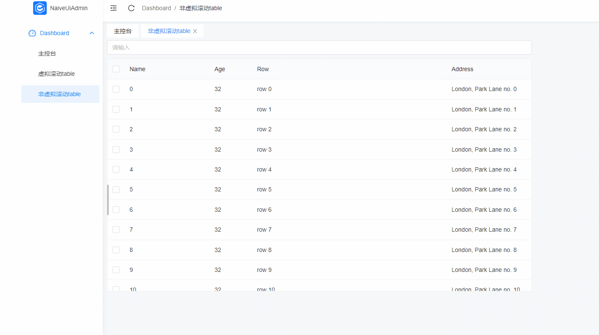

账号：admin，密码：123456

```bash
git clone https://github.com/MYxu/naive-ui-admin-demo.git

yarn install

yarn dev
```

- bug1：开启virtual-scroll，滚动到第5行数据，切换到其他页面后，再切回来就变成第6行数据了，之后每切换两次都会自动加载下一行数据


- src/views/dashboard/dataTable/useVirtualScroll.vue
```
<template>
  <div style="width: 1000px;">
    <n-input v-model="inputVal" style="margin-bottom: 10px;" />
    <n-data-table
      ref="table"
      :columns="columns"
      :data="data"
      :max-height="500"
      :virtual-scroll="true"
    />
  </div>
</template>

<script>
  import { ref, h, defineComponent } from 'vue';

  const columns = [
    {
      type: 'selection',
      fixed: 'left',
    },
    {
      title: 'Name',
      key: 'name',
      width: 200,
      fixed: 'left',
    },
    {
      title: 'Age',
      key: 'age',
      width: 100,
      fixed: 'left',
    },
    {
      title: 'Row',
      key: 'row',
      render(row, index) {
        return h('span', ['row ', index]);
      },
    },
    {
      title: 'Address',
      key: 'address',
      width: 200,
      fixed: 'right',
    },
  ];

  export default defineComponent({
    name: 'dashboardDataTable1',
    setup() {
      return {
        inputVal: ref(0),
        data: Array.apply(null, { length: 200 }).map((_, index) => ({
          key: index,
          name: `${index}`,
          age: 32,
          address: `London, Park Lane no. ${index}`,
        })),
        columns,
      };
    },
  });
</script>
```

- bug2：不开启virtual-scroll，滚动到一定位置，切换到其他页面，然后再切换回来就自动滚动到顶部了

```
<template>
  <div style="width: 1000px;">
    <n-input v-model="inputVal" style="margin-bottom: 10px;" />
    <n-data-table
      ref="table"
      :columns="columns"
      :data="data"
      :max-height="500"
      :virtual-scroll="false"
    />
  </div>
</template>

<script>
  import { ref, h, defineComponent } from 'vue';

  const columns = [
    {
      type: 'selection',
      fixed: 'left',
    },
    {
      title: 'Name',
      key: 'name',
      width: 200,
      fixed: 'left',
    },
    {
      title: 'Age',
      key: 'age',
      width: 100,
      fixed: 'left',
    },
    {
      title: 'Row',
      key: 'row',
      render(row, index) {
        return h('span', ['row ', index]);
      },
    },
    {
      title: 'Address',
      key: 'address',
      width: 200,
      fixed: 'right',
    },
  ];

  export default defineComponent({
    name: 'dashboardDataTable2',
    setup() {
      return {
        inputVal: ref(0),
        data: Array.apply(null, { length: 200 }).map((_, index) => ({
          key: index,
          name: `${index}`,
          age: 32,
          address: `London, Park Lane no. ${index}`,
        })),
        columns,
      };
    },
  });
</script>
```
